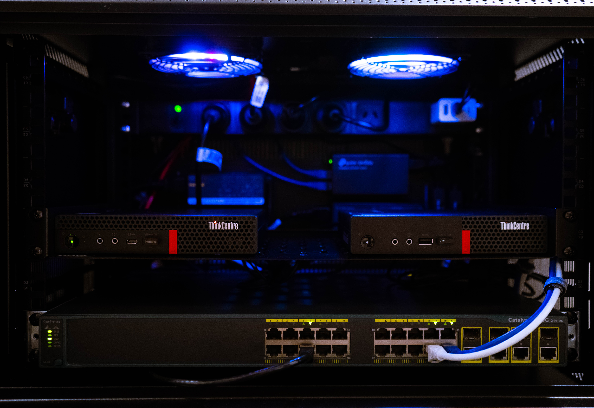

# Homelab Infrastructure README

## Lab Purpose
This homelab serves as a study environment for network routing, virtualization, and service deployment. 
* **Networking:** Core routing via pfSense, VLAN segmentation, and OpenVPN access.
* **Compute:** Proxmox hypervisor hosting core infrastructure services.

## Core Infrastructure
| Hostname    | Hardware         | Primary role           | OS / Platform |
|-------------|------------------|------------------------|---------------|
| pfSense-LAB | Lenovo M720q     | Edge Router / Firewall | pfSense       |
| SW1-LAB     | Cisco C2960G     | Layer 2 switching      | Cisco IOS     |
| Prox-LAB    | Lenovo M910Q     | Primary Hypervisor     | Proxmox VE 8  |
| AP-U7       | Ubiquiti U7 Lite | Wireless access        | UniFi Network |

## Core Services
* **Routing/DHCP/DNS:** Routing & DHCP handled by pfSense, DNS through AdGuard on an LXC.
* **UniFi Controller:** LXC container on Prox-LAB.
* **Remote Access:** OpenVPN server configured on pfSense.

**Quick links:**
* [Net architecture](./docs/network_architecture.md)
* [Router](./docs/hardware/m720q_router.md)
* [Switch](./docs/hardware/c2960g_switch.md)
* [Server](./docs/hardware/m910q_server.md)
* [AP](./docs/hardware/u7_lite.md)

## Visual Overview
