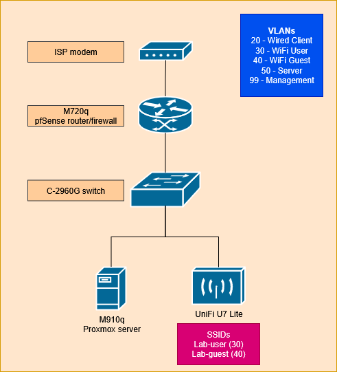

# Network Architecture

## IP Address Scheme

| Interface | Gateway     |
|-----------|-------------|
| WAN       | ISP IP      |
| LAN       | 10.80.100.1 |
| WIREDUSER | 10.80.20.1  |
| WIFIUSER  | 10.80.30.1  |
| WIFIGUEST | 10.80.40.1  |
| SERVER    | 10.80.50.1  |
| MGMT      | 10.80.99.1  |

## DNS & DHCP
* **DHCP Server:** Handled by pfSense across all necessary VLANs. 
* **Internal DNS:** AdGuard Home (LXC on Prox-LAB). pfSense DHCP pushes the AdGuard IP as the primary DNS server to all clients.
* **Upstream DNS:** Cloudflare (1.1.1.1) and Google (8.8.8.8).

## Remote Access (VPN)
* **Protocol:** OpenVPN
* **Server:** pfSense-LAB
* **Tunnel Network:** 10.8.0.0 /24

## Services
* **AdGuard Home:** DNS sinkhole running on an LXC, allowing control over DNS blocklists.
* **UniFi Controller:** AP controller running on an LXC.
* **Seafile:** Secure remote storage solution running on a VM via Docker.

## Network Topology
